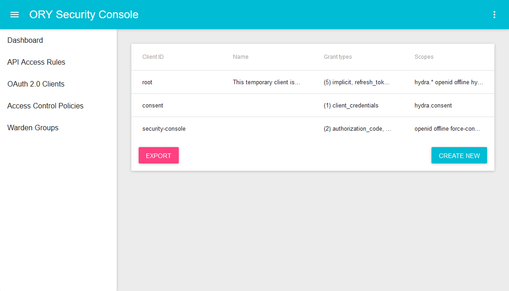

<h1 align="center"></h1>

<h4 align="center">    
    <a href="https://discord.gg/PAMQWkr">Chat</a> |
    <a href="https://community.ory.am/">Forums</a> |
    <a href="http://eepurl.com/di390P">Newsletter</a>  
    <a href="https://www.ory.sh/docs/next/keto/">Guide</a> |
    <a href="https://www.ory.sh/docs/next/keto/sdk/api">API Docs</a> |
    <a href="https://godoc.org/github.com/ory/keto">Code Docs</a>  
    <a href="https://opencollective.com/ory">Support this project!</a>
</h4>

ORY Keto is a permission server that implements best practice access control mechanisms. If you
came looking for the answer to the question:

- is a certain user allowed to modify that blog article?
- is this service allowed to print a document?
- is a member of the ACME organisation allowed to modify data in one of their tenants?
- is this process allowed to execute the worker when coming from IP 10.0.0.2 between 4pm and 5pm on a Monday?
- ...

    
    
    

---

<!-- START doctoc generated TOC please keep comment here to allow auto update -->
<!-- DON'T EDIT THIS SECTION, INSTEAD RE-RUN doctoc TO UPDATE -->

- [Introduction](#introduction)
- [Who's using it?](#whos-using-it)
  - [Installation](#installation)
- [Ecosystem](#ecosystem)
  - [ORY Security Console: Administrative User Interface](#ory-security-console-administrative-user-interface)
  - [ORY Hydra: OAuth2 & OpenID Connect Server](#ory-hydra-oauth2--openid-connect-server)
  - [ORY Oathkeeper: Identity & Access Proxy](#ory-oathkeeper-identity--access-proxy)
  - [Examples](#examples)
- [Security](#security)
  - [Disclosing vulnerabilities](#disclosing-vulnerabilities)
- [Telemetry](#telemetry)
  - [Guide](#guide)
  - [HTTP API documentation](#http-api-documentation)
  - [Upgrading and Changelog](#upgrading-and-changelog)
  - [Command line documentation](#command-line-documentation)
- [Backers](#backers)
- [Sponsors](#sponsors)

<!-- END doctoc generated TOC please keep comment here to allow auto update -->

## Introduction

ORY Keto is a permission server that implements best practice access control mechanisms:

- Available today:
  - ORY-flavored Access Control Policies with exact, glob, and regexp matching strategies
- Available soon:
  - [Access Control Lists](https://en.wikipedia.org/wiki/Access_control_list)
  - [Role Based Access Control](https://de.wikipedia.org/wiki/Role_Based_Access_Control)
  - Role Based Access Control with Context (Google/Kubernetes-flavored)
  - Amazon Web Services Identity & Access Management Policies (AWS IAM Policies)

Each mechanism is powered by a decision engine implemented on top of the
[Open Policy Agent](https://www.openpolicyagent.org/) and provides well-defined management and authorization endpoints.

## Who's using it?

<!--BEGIN ADOPTERS-->
The ORY community stands on the shoulders of individuals, companies, and maintainers. We thank everyone involved - from
submitting bug reports and feature requests, to contributing patches, to sponsoring our work. Our community is
1000+ strong and growing rapidly. The ORY stack protects 1.200.000.000+ API requests every month with over
15.000+ active service nodes. Our small but expert team would have never been able to achieve this without each and
everyone of you.

The following list represents companies that have accompanied us along the way and that have made outstanding contributions
to our ecosystem. *If you think that your company deserves a spot here, reach out to <a href="mailto:hi@ory.sh">hi@ory.sh</a>now*!

**Please consider giving back by becoming a sponsor of our open source work on <a href="https://www.patreon.com/_ory">Patreon</a> or 
<a href="https://opencollective.com/ory">Open Collective</a>.**

<table>
    <thead>
        <tr>
            <th>Type</th>
            <th>Name</th>
            <th>Logo</th>
            <th>Website</th>
        </tr>
    </thead>
    <tbody>
        <tr>
            <td>Sponsor</td>
            <td>Raspberry PI Foundation</td>
            <td align="center"></td>
            <td><a href="https://www.raspberrypi.org/">raspberrypi.org</a></td>
        </tr>
        <tr>
            <td>Contributor</td>
            <td>Kyma Project</a>
            <td align="center"></td>
            <td><a href="https://kyma-project.io">kyma-project.io</a></td>
        </tr>
        <tr>
            <td>Sponsor</td>
            <td>ThoughtWorks</td>
            <td align="center"></td>
            <td><a href="https://www.thoughtworks.com/">thoughtworks.com</a></td>
        </tr>
        <tr>
            <td>Sponsor</td>
            <td>Tulip</td>
            <td align="center"></td>
            <td><a href="https://tulip.com/">tulip.com</a></td>
        </tr>
        <tr>
            <td>Sponsor</td>
            <td>Cashdeck / All My Funds</td>
            <td align="center"></td>
            <td><a href="https://cashdeck.com.au/">cashdeck.com.au</a></td>
        </tr>
        <tr>
            <td>Sponsor</td>
            <td>3 Rein</td>
            <td align="center"></td>
            <td><a href="https://3rein.com/">3rein.com</a> <em>(avaiable soon)</em></td>
        </tr>
        <tr>
            <td>Contributor</td>
            <td>Hootsuite</td>
            <td align="center"></td>
            <td><a href="https://hootsuite.com/">hootsuite.com</a></td>
        </tr>
        <tr>
            <td>Adopter *</td>
            <td>Segment</td>
            <td align="center"></td>
            <td><a href="https://segment.com/">segment.com</a></td>
        </tr>
        <tr>
            <td>Adopter *</td>
            <td>Arduino</td>
            <td align="center"></td>
            <td><a href="https://www.arduino.cc/">segment.com</a></td>
        </tr>
    </tdbody>
</table>

We also want to thank all individual contributors

</a>

as well as all of our backers

and past & current supporters (in alphabetical order) on [Patreon](https://www.patreon.com/_ory): Alexander Alimovs,
Billy, Chancy Kennedy, Drozzy, Edwin Trejos, Howard Edidin, Ken Adler Oz Haven, Stefan Hans, TheCrealm.

<em>* Uses one of ORY's major projects in production.</em>

<!--END ADOPTERS-->

### Installation

Head over to the documentation to learn about ways of [installing ORY Keto](https://www.ory.sh/docs/next/keto/install).

## Ecosystem

### ORY Security Console: Administrative User Interface

The [ORY Security Console](https://console.ory.sh/) is a visual admin interface for ORY Hydra,
ORY Oathkeeper, and ORY Keto.

### ORY Hydra: OAuth2 & OpenID Connect Server

[ORY Hydra](https://github.com/ory/hydra) ORY Hydra is a hardened OAuth2 and OpenID Connect server optimized
for low latency, high throughput, and low resource consumption. ORY Hydra is not an identity provider, which would include
user sign up, user log in, or password reset flow. Hydra connects to your existing identity provider through a consent app.

### ORY Oathkeeper: Identity & Access Proxy

[ORY Oathkeeper](https://github.com/ory/oathkeeper) is a BeyondCorp/Zero Trust Identity & Access Proxy (IAP) built
on top of OAuth2 and ORY Hydra.

### Examples

The [ory/examples](https://github.com/ory/examples) repository contains numerous examples of setting up this project and combining it with other services from the ORY Ecosystem.

## Security

### Disclosing vulnerabilities

If you think you found a security vulnerability, please refrain from posting it publicly on the forums, the chat, or GitHub
and send us an email to [hi@ory.am](mailto:hi@ory.am) instead.

## Telemetry

Our services collect summarized, anonymized data which can optionally be turned off. Click
[here](https://www.ory.sh/docs/ecosystem/sqa) to learn more.

### Guide

The Guide is available [here](https://www.ory.sh/docs/next/keto/).

### HTTP API documentation

The HTTP API is documented [here](https://www.ory.sh/docs/next/keto/sdk/api).

### Upgrading and Changelog

New releases might introduce breaking changes. To help you identify and incorporate those changes, we document these
changes in [UPGRADE.md](./UPGRADE.md) and [CHANGELOG.md](./CHANGELOG.md).

### Command line documentation

Run `keto -h` or `keto help`.

## Backers

Thank you to all our backers! 🙏 [[Become a backer](https://opencollective.com/ory#backer)]

We would also like to thank (past & current) supporters (in alphabetical order) on [Patreon](https://www.patreon.com/_ory): Alexander Alimovs, Billy, Chancy Kennedy, Drozzy, Edwin Trejos, Howard Edidin, Ken Adler Oz Haven, Stefan Hans, TheCrealm

## Sponsors

Sponsors support this project. The sponsor's logo or brand will show up here with a link to the website. [[Become a sponsor](https://opencollective.com/ory#sponsor)]

A special thanks goes out to **Wayne Robinson** for supporting this ecosystem with \$200 every month since Oktober 2016 [on Patreon](https://www.patreon.com/_ory).
